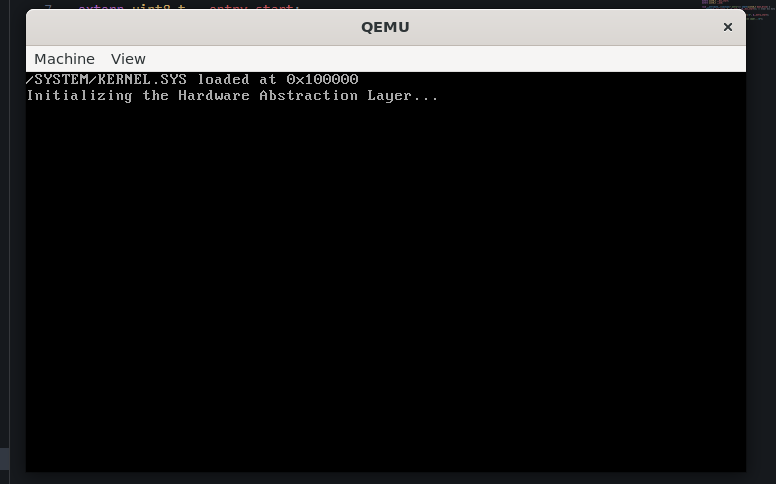
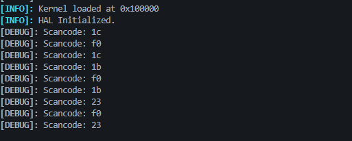

# TigerOS

TigerOS is a simple operating system made from scratch. 

Currently, it is still in early beta.

## Dependencies

Before building the OS, you need a few tools.

- `nasm` - assembler
- `make` - build tool
- `qemu` - virtualization software for testing the OS
- `dosfstools` - creating the filesystem on the disk
- `mtools` - managing files on the disk
- GCC cross compiler dependencies

**Here are some commands you can use to install these dependencies:**

### Ubuntu & Debian

```
$ sudo apt update
$ sudo apt install build-essential bison flex libgmp3-dev libmpc-dev libmpfr-dev texinfo nasm make qemu-system-x86 mtools
```

### Fedora & CentOS

```
$ sudo dnf upgrade
$ sudo dnf install gcc gcc-c++ bison flex gmp-devel libmpc-devel mpfr-devel texinfo nasm make qemu-system-x86 mtools
```

### Arch

```
$ sudo pacman -Syu
$ sudo pacman -S base-devel gmp libmpc mpfr nasm make qemu-system-x86 dosfstools mtools
```

### Homebrew

```
$ brew install gcc bison flex gmp libmpc mpfr texinfo nasm make dosfstools mtools
```

## Building

### Toolchain

Before building, you need to build the GCC cross compiler and binutils.
Run `make toolchain` to build the toolchain. This might take a few minutes.

Use `make clean-toolchain` to clear the toolchain directory.

### Code

Simply run `make` to compile the OS code automatically using the Makefile.

You can also specify specific targets to build like `disk` or `kernel`.
To see a list of targets, use `make help`.

If you want to clean the build directory, run `make clean`

## Testing

Use the `./run` script to run TigerOS in QEMU.

**It might look something like this:**



**You will also see debug logs in the terminal if you are using QEMU.**



## Debugging

Use the `./debug` script to run TigerOS in QEMU with debugging.

Then, in another terminal, connect to QEMU in gdb using `target remote :1234`

- Use `break *[address]` to set a breakpoint.
- Use `c` to continue execution unt.mine the registers.
- Use `x [address]` to examine memory. You can specify options with a slash. (ex. `x/2xb` prints two bytes)

## TDISK

TigerOS includes a tool called TDISK (Tiger Disk Utility). TDISK is compiled before the OS is built because it is used for different disk operations.

If you would like to install TDISK for use outside of the project, run `sudo make tdisk-install` after you have compiled it.
TDISK and the TDISK man pages will be installed to `/usr/local/`.

## Copyright

*TigerOS  Copyright (C) 2026  tigercodes-dev <https://github.com/tigercodes-dev>*

*This program comes with ABSOLUTELY NO WARRANTY.*
*This is free software, and you are welcome to redistribute it under certain conditions.*

*See [COPYING](./COPYING) for more information.*
